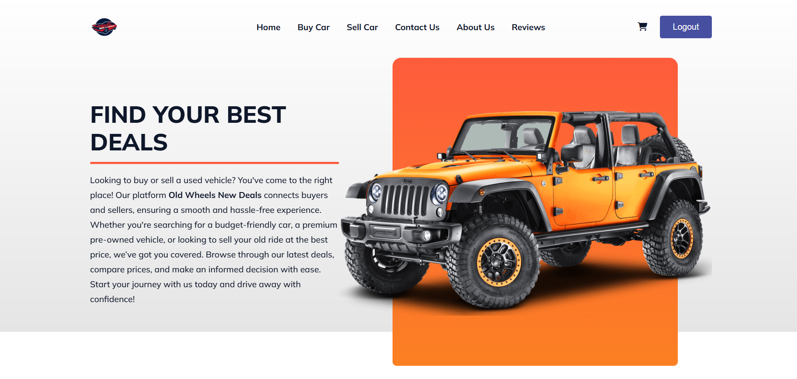
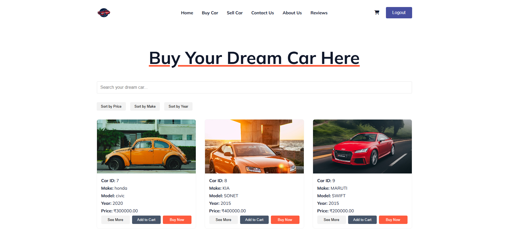
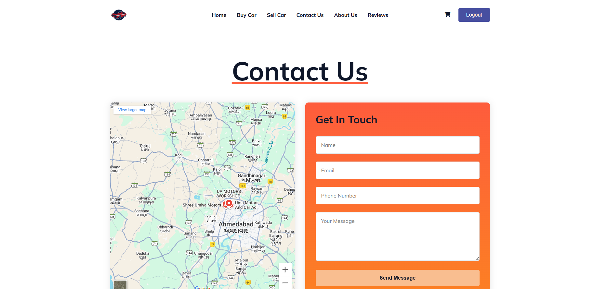
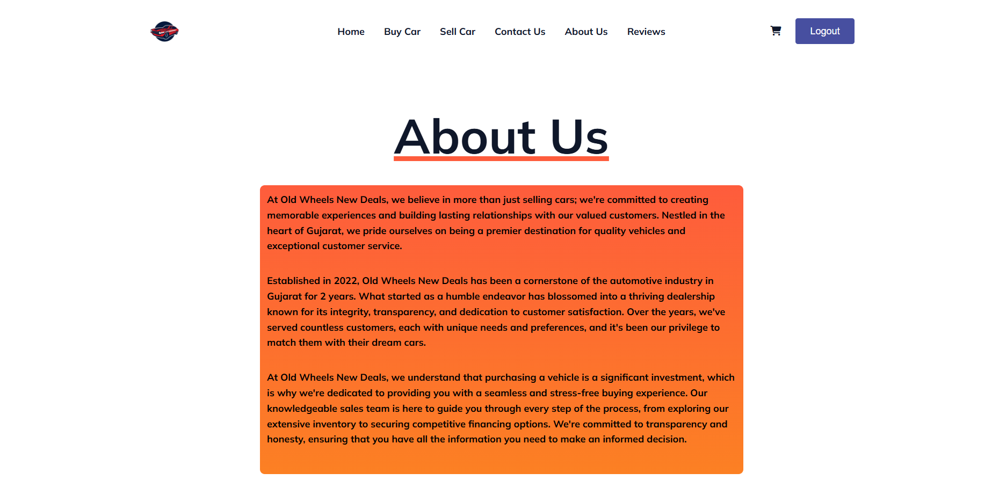
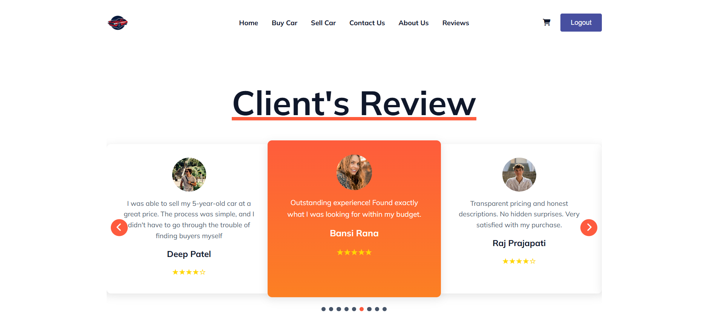

# 🚗 Old Wheels New Deals

### **Buy & Sell Used Cars with Ease!**  

**Old Wheels New Deals** is a user-friendly platform that allows customers to **buy and sell old vehicles** conveniently. With a sleek design and a powerful backend, this platform ensures a **seamless experience** for both buyers and sellers.

---

## 📸 **Screenshots**

### 🔹 Home Page
  

### 🔹 Buy Car Page
  

### 🔹 Sell Car Page
  

### 🔹  Contact Us Page
  

### 🔹  about Us Page
  

### 🔹  review Page
  

---

## 🚀 **Features**

✔️ **User Authentication** (Sign Up, Login, Forgot Password)  
✔️ **Buy & Sell Used Vehicles**  
✔️ **Shopping Cart** for Selected Vehicles  
✔️ **Secure Transactions**  
✔️ **Responsive & Modern UI**  
✔️ **MySQL Database Integration**  
✔️ **Contact Form & Customer Support**  
✔️ **Customer Reviews & Ratings**  
✔️ **Mobile-Friendly Interface**  

---

## 🛠️ **Technologies Used**

| Technology | Description |
|------------|------------|
| **Frontend** | HTML, CSS, JavaScript |
| **Backend** | PHP |
| **Database** | MySQL |
| **Icons & UI** | FontAwesome, Remix Icons |
| **Libraries** | ScrollReveal.js |

---

## 📥 **Installation & Setup Guide**

### 🔧 **Prerequisites**
Before running this project, ensure you have:

- A **local web server** (XAMPP)
- **PHP** installed 
- **MySQL** database
- A web browser (Chrome)
